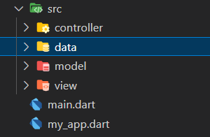

# TodoAPP

## Desafio

Criar um Todo App consumindo a API da [Crud Crud](https://crudcrud.com/)

## Implementação

- :star: criação do endPoint:
- [ ] '/todo'
- :star: implementação das chamadas
- [ ] get TODO
- [ ] post TODO
- [ ] put TODO
- [ ] delete TODO
- :star: definição da arquitetura

## Dependências Utilizadas

- [http](https://pub.dev/packages/http)

### Referências

[Atividade Entregável Notion](https://proz-tecnologia.notion.site/proz-tecnologia/Atividade-Entreg-vel-Turma-01-e855276682b3438ba89a95be9a9a26ab)
[Using Sliver](https://docs.flutter.dev/development/ui/advanced/slivers)
[Medium - Slivers](https://medium.com/flutter/slivers-demystified-6ff68ab0296f)
[cookBook - slivers](https://dartpad.dev/workshops.html?webserver=https://dartpad-workshops-io2021.web.app/getting_started_with_slivers)
